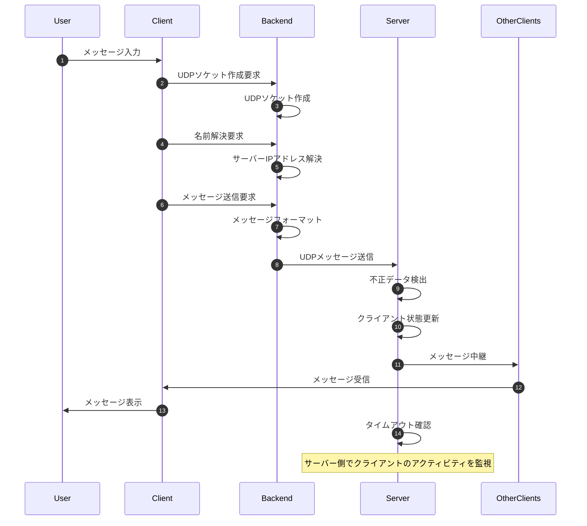
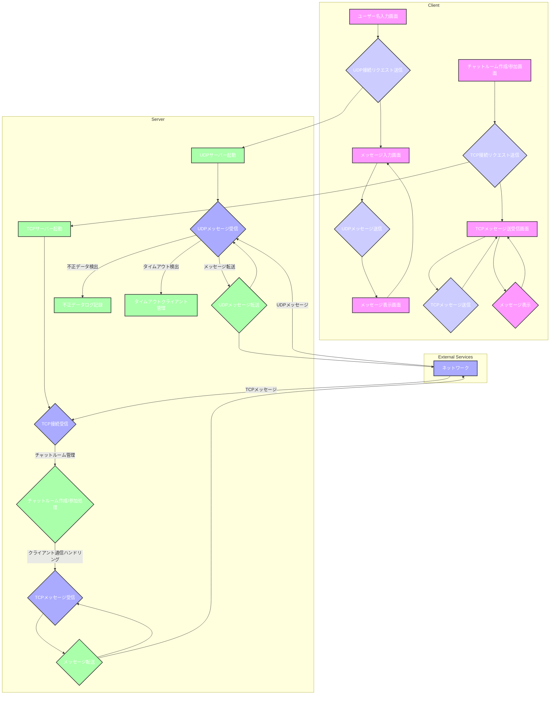

## online-chat-messenger

### 概要

このプロジェクトは、Python で作成されたオンラインチャットメッセンジャーシステムである。  
TCP でチャットルームの作成、入室を行い、UDP でメッセージの送受信を行う。

### 利用フロー

1. **チャットルームの作成**
   - ユーザーが新しいチャットルームを作成する（TCP 通信）。
   - サーバーはルームを初期化し、クライアントにトークンを送信する。
2. **他のユーザーの参加**
   - 他のクライアントがトークンを使用してルームに参加する（TCP 通信）。
3. **メッセージのやり取り**
   - 各クライアントが UDP を使用してメッセージを送受信する。
4. **切断時の処理**
   - クライアントが切断すると、サーバーはトークンを削除し、ルームが空の場合は削除する。

### サーバーコード

#### **基本設定**

```python
HOST = '127.0.0.1'
TCP_PORT = 9001
UDP_PORT = 9002
```

- **HOST**: サーバーのホストアドレス。ローカルでテストするため `127.0.0.1` を指定。
- **TCP_PORT**: TCP 接続に使用するポート。
- **UDP_PORT**: UDP 接続に使用するポート。

#### **チャットルームのデータ構造**

```python
chat_rooms = {}  # {"room_name": {"tokens": [token1, ...], "users": {}, "udp_clients": []}}
```

- 各チャットルームは以下の情報を保持:
  - **tokens**: 参加可能なトークンのリスト。
  - **users**: トークンに紐づけられたユーザー。
  - **udp_clients**: UDP 通信を行うクライアントのアドレスリスト。

#### **TCP クライアントのハンドリング**

```python
def handle_tcp_client(client_socket):
```

- TCP 接続の管理を担当。主にチャットルーム作成やトークン配布、UDP 情報の登録を行う。

```python
room_name = None
token = None
```

- `finally` 節でクライアント切断時の処理に必要な変数を事前に定義。

##### **ヘッダーとボディの処理**

```python
header = receive_all(client_socket, 32)
room_name_size, operation, state, operation_payload_size = struct.unpack('!BBB29s', header)
body = receive_all(client_socket, room_name_size + operation_payload_size)
room_name = body[:room_name_size].decode('utf-8')
payload = body[room_name_size:].decode('utf-8')
```

- **ヘッダー**: 固定長 32 バイトのデータで、メッセージの構造を定義。
- **ボディ**: ルーム名と実際のペイロードデータを含む。

##### **チャットルーム作成**

```python
if operation == 1 and state == 0:  # 新しいチャットルーム作成
```

- トークンを生成し、チャットルームを初期化。各トークンを TCP 経由でクライアントに送信。

##### **UDP 情報の登録**

```python
elif operation == 3 and state == 0:  # UDPポート情報登録
```

- クライアントの UDP ポートをチャットルームに登録。これによりクライアント間で UDP メッセージをリレーできるようになる。

##### **クライアント切断の処理**

```python
if room_name and room_name in chat_rooms:
     for tok, user in chat_rooms[room_name]["users"].items():
          if user == client_socket.getpeername():
                token = tok
                break
```

- 切断したクライアントのトークンを削除。ルームが空になった場合はルーム自体を削除。
- 他のクライアントに切断メッセージを送信。

#### **UDP チャットサーバー**

```python
def udp_chat_server():
```

- UDP 通信を管理。クライアントからのメッセージを受信し、同じチャットルーム内のクライアントにリレー。

```python
data, addr = udp_sock.recvfrom(4096)
```

- 最大 4096 バイトのデータを受信。ヘッダー（ルーム名サイズ、メッセージサイズ）を解析し、メッセージをリレー。

### クライアントコード

#### **TCP 通信の処理**

```python
def receive_messages(sock):
```

- TCP 接続でトークンやシステムメッセージを受信し、適切に処理。

```python
if operation == 1 and state == 2:
     print(f"[トークン受信] {payload}")
```

- チャットルーム作成時にトークンを受信して表示。

#### **UDP 送信と受信**

```python
def udp_send(sock, server_address, room_name):
```

- ユーザー入力を UDP パケットとして送信。ルーム名とメッセージをヘッダーに含める。

```python
def udp_receive(sock):
```

- サーバーからの UDP パケットを受信し、メッセージを表示。

#### **メイン処理**

```python
udp_sock = socket.socket(socket.AF_INET, socket.SOCK_DGRAM)
udp_sock.bind(('0.0.0.0', 0))
udp_port = udp_sock.getsockname()[1]
```

- クライアントが動的にポートを選択して UDP 通信を開始。

```python
header = struct.pack('!BBB29s', len(room_name), 3, 0, str(len(str(udp_port))).encode('utf-8').ljust(29, b'\x00'))
body = room_name.encode('utf-8') + str(udp_port).encode('utf-8')
tcp_sock.sendall(header + body)
```

- UDP ポートをサーバーに通知。

#### **改善ポイント**

1. **切断時のエラーハンドリング**: `room_name` や `token` のスコープを適切に管理。
2. **メッセージリレーの効率化**: UDP クライアント間の通信を最適化。
3. **エラー表示の改善**: デバッグログで問題箇所を明確化。

### 処理シーケンス



### 構成図



### クライアント側で文字化けするエラー

以下のログをサーバー側の送信箇所に仕込み、  
中身のデータが期待するものか確認すれば良い。

```py
print(f"Sending header: room_name_size={len(room)}, operation=2, state=0, payload_size={payload_size}")
print(f"Sending body: room_name={room}, payload={response_message}")
```

### サーバーを終了するとき

まずクライアントを落としてからサーバーを落とすこと。  
そうしないと、サーバーのポートが開放されない時がある。

### request header, body の構造

#### データの構造を確認

**Request Header**:

```plaintext
b'\x04\x01\x001\x00\x00\x00\x00\x00\x00\x00\x00\x00\x00\x00\x00\x00\x00\x00\x00\x00\x00\x00\x00\x00\x00\x00\x00\x00\x00\x00\x00'
```

**Request Body**:

```plaintext
b'hogea'
```

#### ヘッダーの構造:

- **RoomNameSize**（1 バイト）: `\x04` = 4
- **Operation**（1 バイト）: `\x01` = 1
- **State**（1 バイト）: `\x00` = 0
- **OperationPayloadSize**（残り 29 バイト）:
  - `b'1\x00\x00\x00\x00\x00\x00\x00\x00\x00\x00\x00\x00\x00\x00\x00\x00\x00\x00\x00\x00\x00\x00\x00\x00\x00\x00\x00\x00'`
  - `\x31` = ASCII 文字 `'1'` に対応し、残りはすべてゼロバイト。

#### ボディの構造:

- **RoomNameSize（4 バイト）**: ルーム名は `hogea` の最初の 4 バイト `hoge`。
- **OperationPayloadSize**（1 バイト）: 残りの 1 バイト `a`。

### 要件との照合

1. **ヘッダー（32 バイト）**

   - **RoomNameSize（1 バイト）**: `\x04` = 4 (OK: 最大 28 バイト以下)
   - **Operation（1 バイト）**: `\x01` = 1 (OK)
   - **State（1 バイト）**: `\x00` = 0 (OK)
   - **OperationPayloadSize（29 バイト）**:
     - ASCII `'1'` と 28 バイトのゼロバイト。OperationPayloadSize の最大値 229 バイト以下で問題なし (OK)

2. **ボディ**
   - **RoomNameSize に基づくルーム名**: 最初の 4 バイト `hoge` は RoomNameSize に基づく値で問題なし (OK)
   - **OperationPayloadSize に基づくペイロード**: 残り 1 バイト `a`。最大 229 バイト以下なので問題なし (OK)

### 制約条件とセキュリティ

1. **UDP 通信の信頼性**
   - UDP は信頼性のあるプロトコルではないため、パケットが失われる可能性がある。重要なメッセージには TCP を使用すること。
2. **トークンの認証**
   - トークンはサーバーで生成されるが、簡易なシステムのためトークンの改ざんに注意すること。
3. **ローカル環境での使用**
   - このシステムはローカルネットワーク内での使用を想定している。インターネットでの使用時は追加のセキュリティ対策（認証、暗号化）を導入すること。
